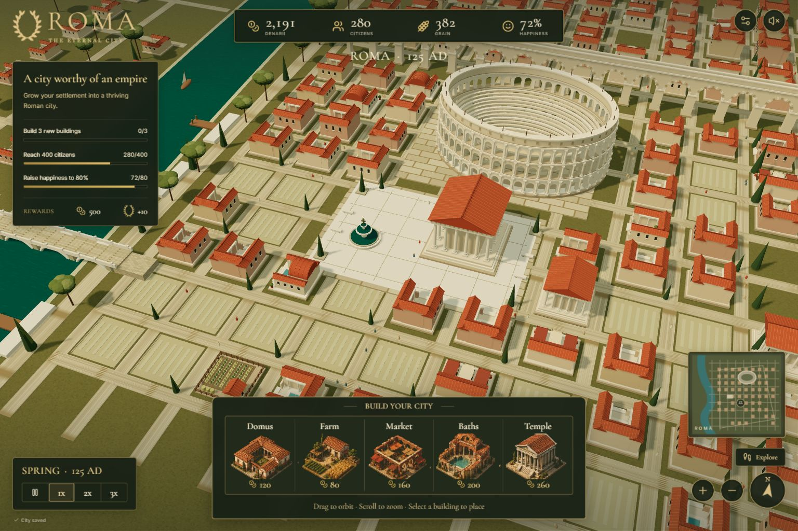
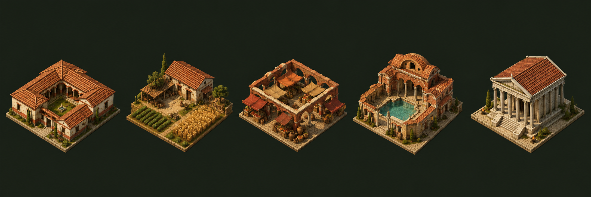
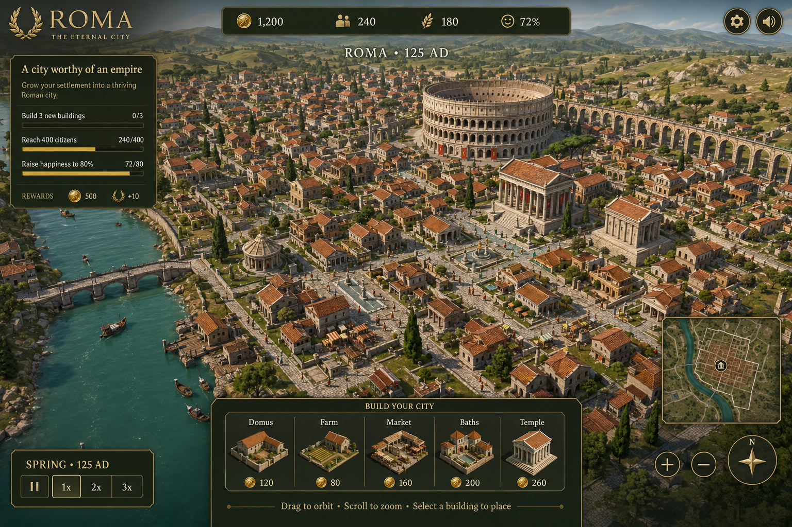

# ROMA — The Eternal City

A playable 3D Roman city builder. Raise a thriving city beside the Tiber, walk its streets, and earn the Senate's recognition.



## Play immediately

1. Download this repository using **Code → Download ZIP**, then extract it.
2. Open **[play/index.html](play/index.html)** in Chrome, Edge, or another browser with WebGL support.
3. Choose a building and click a highlighted empty plot to begin.

The ready-to-play file includes the game, 3D engine, fonts, and artwork. Once downloaded, it runs without installing dependencies or using an internet connection. GitHub's file viewer shows the HTML source; download the file to play it.

## Build your Rome

- Explore a real 3D city with an open Colosseum, aqueduct arches, columned temples, courtyards, farms, riverboats, and moving citizens.
- Place five building types to manage housing, grain, income, and happiness.
- Complete three objectives: construct **3 buildings**, reach **400 citizens**, and achieve **80% happiness**.
- Receive **500 denarii and 10 glory**, then keep building.
- Pause the economy, switch between 1× / 2× / 3× speed, and continue from automatic browser saves.
- Play with mouse and keyboard or a responsive touch interface with on-screen walking controls.

### Construction



| Building | Cost | Benefit |
| --- | ---: | --- |
| Domus | 120 denarii | +80 housing |
| Farm | 80 denarii | +5 grain per second |
| Market | 160 denarii | +6 denarii per second |
| Baths | 200 denarii | +8 happiness |
| Temple | 260 denarii | +12 happiness |

## Controls

| Action | Control |
| --- | --- |
| Orbit the city | Drag |
| Pan the camera | Right-drag |
| Zoom | Scroll, pinch, or + / − |
| Select a building | Construction dock or keys **1–5** |
| Place a building | Click a highlighted empty plot |
| Cancel placement | **Escape** |
| Walk through the city | Choose **Explore** |
| Move on foot | **WASD**, arrow keys, or on-screen arrows |
| Look around on foot | Drag |
| Run | Hold **Shift** while moving |
| Return to the overview | **H**, **Escape** while walking, or the compass |
| Pause / resume the economy | **Space** or the playback button |

Progress is saved in the current browser. Different browsers and addresses can have separate saves. The settings panel includes a guide and **New city** control.

## Run the source

Use **Node.js 22 or later** and npm.

```sh
git clone https://github.com/TarunT27/roma-eternal-city.git
cd roma-eternal-city
npm ci
npm run dev
```

Open the local address printed by Vite. Development uses port **5173**.

```sh
npm test          # Economy, placement, objectives, and save validation
npm run build    # Creates the portable dist/index.html
```

The checked-in `play/index.html` is the ready-to-play snapshot. After changing the source, build again and copy `dist/index.html` to `play/index.html` to refresh that snapshot.

## Project structure

```text
src/
  App.jsx            Game state and interface coordination
  ui.jsx             Resource bar, construction dock, objectives, and dialogs
  styles.css         Desktop and mobile presentation
  game.js            Economy, placement rules, objectives, and local saves
  game.test.js       Automated game-rule tests
  world.js           Scene, camera, selection, walking, and animation
  models.js          Roman architecture and vegetation
  assets/            Embedded building selection artwork
play/index.html      Ready-to-play, self-contained game
docs/images/         Gameplay screenshot and initial concept
docs/licenses/       Third-party license notices
.github/workflows/   Automated test and build checks
```

Built with **React, Three.js, Vite, Lucide, Cormorant Garamond, and Inter**. The single-file build embeds its assets for offline play.

## Validation

The game was played in a browser at desktop and phone sizes. Construction, housing growth, happiness, victory, pause/speed controls, saving, building inspection, and exploration were checked. Six automated test groups cover placement constraints, economy limits, fractional simulation, victory rewards, and invalid or unavailable save storage. GitHub Actions runs the tests and production build on pushes and pull requests.

## Art direction

<details>
<summary>View the original visual concept</summary>



The concept established the terracotta roofs, limestone monuments, teal river, dark olive panels, and brass details. The playable game uses deliberately simpler low-poly geometry that can be navigated and expanded in real time. The concept and construction illustrations were generated with Image Gen; the world is rendered from Three.js models.

</details>

ROMA is a creative interpretation of ancient Rome. Third-party dependencies and bundled fonts retain their respective licenses; see [third-party notices](THIRD_PARTY_NOTICES.md).
